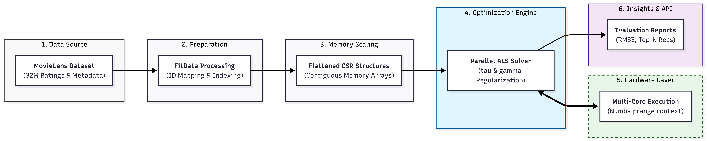

# Architecting a Scalable Recommender System: From ALS to Production-Ready API

[](https://aims-danflix.onrender.com)
[](https://opensource.org/licenses/MIT)
[](https://www.python.org/downloads/)

This repository contains the end-to-end implementation of a high-performance movie recommender system as detailed in the paper: **"Architecting a Scalable Recommender System: From Alternating Least Squares to Production-Ready API"**.

## 📝 Abstract
This work details the design, optimization, and deployment of a recommender system utilizing **Alternating Least Squares (ALS)** on the **MovieLens 32M dataset**. We analyze model sensitivity across varying latent dimensions ($K \in \{2, 10, 20\}$) and architect a scalable API using **FastAPI** and **Jinja2**, deployed on the Render cloud platform. To resolve common collaborative filtering "ID glitches," we introduce a hybrid post-processing layer that integrates **OMDb metadata validation** to refine relevance in real-time.

---

## 🏗️ System Architecture
The system is built to scale from raw matrix factorization to a user-facing cloud application.


*Figure 1: End-to-end pipeline from sparse indexing to cloud-based API serving.*

---

## 📊 Exploratory Data Analysis (EDA)
We analyzed 32 million interactions to understand the statistical behavior of users and items. The dataset exhibits a classic heavy-tailed distribution, necessitating robust regularization.

**Key Insights:**
* **Systematic Positivity Bias:** Mean rating is 3.54; users are more likely to rate movies they enjoy.
* **Scale-Free Network:** The linear descent in the log-log plot (d) validates that the vast majority of items have very few ratings, highlighting the "Long Tail" challenge.

---

## 🚀 Model Performance
We evaluated the model across different latent dimensions ($K$). While higher $K$ reduces training loss, it introduces a risk of overfitting.

### 📉 Training Convergence
* **$K=2$:** Suffers from high bias (underfitting).
* **$K=10$:** Optimal balance for generalization and semantic recovery.
* **$K=20$:** Achieves lowest training error but shows test RMSE divergence (overfitting).

### 🌌 Latent Space Geometry
The model successfully recovers the latent taxonomy of the film industry purely from user interaction data.
---

## 🛠️ Tech Stack & Implementation
* **Solver:** Custom ALS implementation using **Numba** with `prange` parallel loops for high-speed CPU performance.
* **Backend:** **FastAPI** for high-concurrency request handling.
* **Frontend:** **Jinja2** templates with **Tailwind CSS**.
* **Cloud:** Deployed on **Render** (Free Tier).
* **Metadata:** Hybrid integration with **OMDb** and **TMDB** for real-time poster and plot retrieval.

---

## 💻 Installation & Setup

1. **Clone the repository:**
   ```bash
   git clone https://github.com/DanielAyomide-git/applied-ml-at-scale-aims2025.git
   cd applied-ml-at-scale-aims2025
   ```

2. **Set up Environment:**
   Create a `.env` file in the root directory and add your API keys:
   ```env
   OMDB_KEY=your_omdb_key
   TMDB_KEY=your_tmdb_key
   ```

3. **Install dependencies:**
   ```bash
   pip install -r requirements.txt
   ```

4. **Run the API:**
   ```bash
   uvicorn app.main:app --reload
   ```

---

## 📖 Citation
If you use this work in your research, please cite:

```latex
@article{olanrewaju2025architecting,
  title={Architecting a Scalable Recommender System: From Alternating Least Squares to Production-Ready API},
  author={Olanrewaju, Daniel Ayomide},
  journal={AIMS South Africa Technical Report},
  year={2025}
}
```

## 👤 Author
**Daniel Ayomide Olanrewaju**  
African Institute for Mathematical Sciences (AIMS) South Africa  
📧 [dolan@aims.ac.za](mailto:dolan@aims.ac.za)  
🔗 [GitHub Profile](https://github.com/DanielAyomide-git)

---
*Note: This project was developed as part of the Applied Machine Learning at Scale course at AIMS South Africa (2025).*
